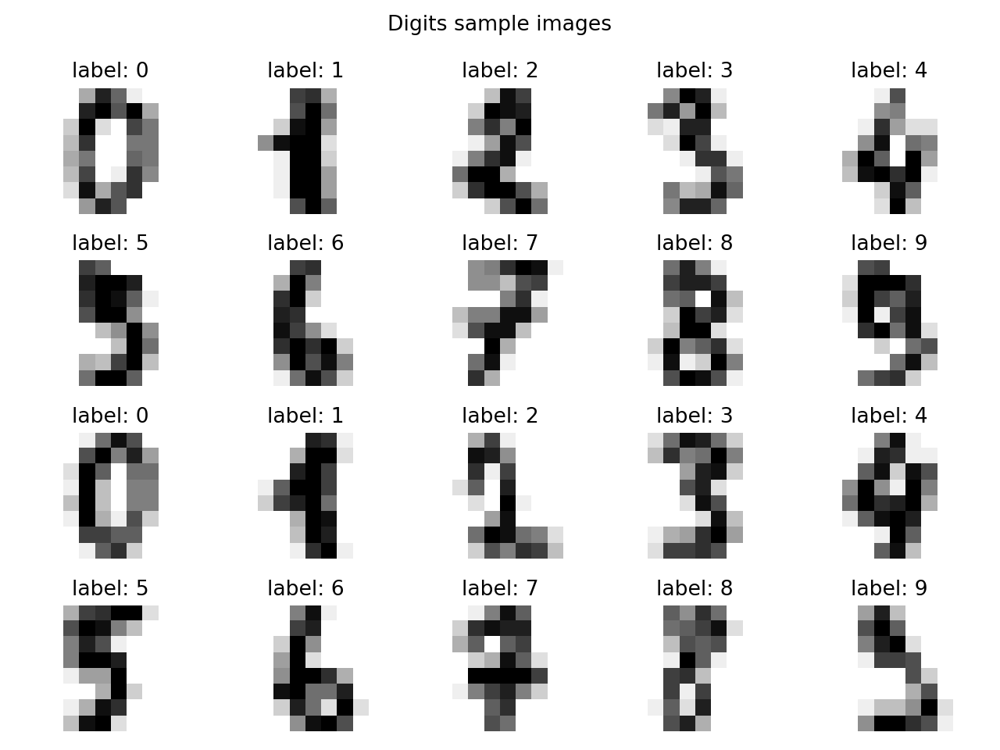
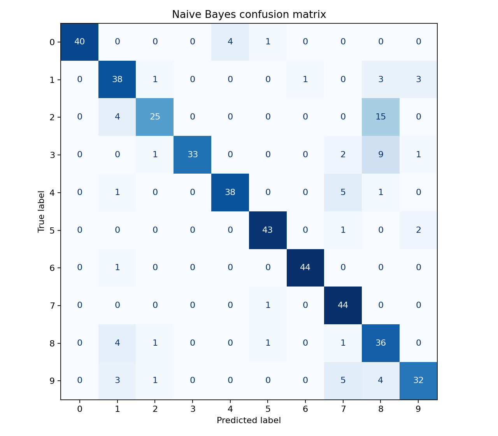
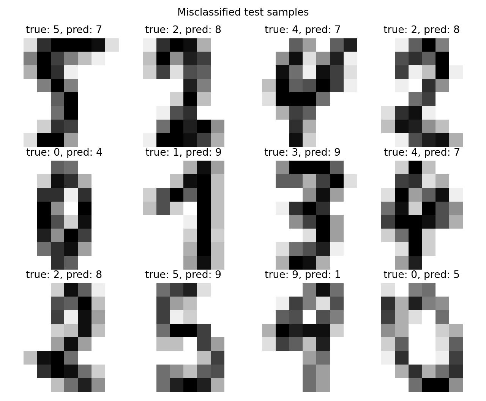

# sklearn digits 手写数字分类实验报告

## 一、数据集说明

本次作业使用 `sklearn.datasets.load_digits()` 自带的 digits 手写数字数据集。该数据集是灰度手写数字图像分类数据集，类别为数字 0 到 9。

| 项目 | 内容 |
| --- | --- |
| 数据类型 | 手写数字灰度图像 |
| 图像数量 | 1797 张 |
| 图像大小 | 8 x 8 |
| 类别数量 | 10 类 |
| 类别标签 | 0 到 9 |
| 任务类型 | 图像分类 |

每张图像可以展开成一个 64 维特征向量，用于训练机器学习分类器。

样本图像如下：



## 二、数据准备

通过如下代码加载数据集：

```python
from sklearn.datasets import load_digits

digits = load_digits()
x = digits.data
y = digits.target
images = digits.images
```

查看数据可知：

- 数据集共有 1797 张图像。
- 每张图像大小为 8 x 8。
- 每张图像展开后得到 64 维特征。
- 类别标签为 0、1、2、3、4、5、6、7、8、9。

## 三、数据划分

本实验将数据集划分为训练集和测试集，测试集比例约为 25%。

```python
from sklearn.model_selection import train_test_split

x_train, x_test, y_train, y_test = train_test_split(
    x,
    y,
    test_size=0.25,
    random_state=42,
    stratify=y,
)
```

划分结果：

| 数据集 | 数量 | 用途 |
| --- | ---: | --- |
| 训练集 | 1347 | 用于训练模型，让模型学习图像特征与数字标签之间的关系 |
| 测试集 | 450 | 用于评估模型在未见过数据上的分类效果 |

使用 `stratify=y` 可以保持训练集和测试集中各数字类别的比例基本一致，使评估结果更加稳定。

## 四、特征表示

digits 数据集中每张原始图像是一个 8 x 8 的二维灰度矩阵。传统机器学习模型通常接收一维特征向量，因此需要将每张图像展开为 64 维向量。

例如，一张 8 x 8 图像：

```text
[[ 0,  0,  5, ...,  0],
 [ 0,  1, 13, ...,  0],
 ...
 [ 0,  0,  6, ...,  0]]
```

会被转换为：

```text
[0, 0, 5, ..., 0, 0, 1, 13, ..., 0, ..., 0, 0, 6, ..., 0]
```

这样做的原因是 KNN、朴素贝叶斯、逻辑回归、SVM、决策树、随机森林等传统机器学习算法通常基于特征向量进行计算，而不是直接处理二维图像矩阵。

原始像素特征的优点是简单直观，不需要额外人工设计特征；局限是它只保留像素强度信息，对图像平移、旋转、书写形状变化等不够鲁棒。如果数字位置稍有偏移，展开后的特征向量变化会比较明显。

## 五、模型训练与结果比较

本实验使用了以下 6 种传统机器学习分类方法：

- KNN
- Naive Bayes
- Logistic Regression
- SVM
- Decision Tree
- Random Forest

实验结果如下：

| 模型 | 测试准确率 |
| --- | ---: |
| SVM | 0.9800 |
| Logistic Regression | 0.9778 |
| Random Forest | 0.9667 |
| KNN | 0.9667 |
| Naive Bayes | 0.8289 |
| Decision Tree | 0.8244 |

从结果看，SVM 的测试准确率最高，达到 0.9800；Decision Tree 的测试准确率最低，为 0.8244。不同模型之间的表现差异比较明显，尤其是 SVM、逻辑回归、随机森林、KNN 明显优于朴素贝叶斯和单棵决策树。

产生差异的原因可能包括：

- SVM 适合处理中小规模、高维特征分类问题，能够找到较好的分类边界。
- 逻辑回归经过标准化后可以较好地利用 64 个像素特征。
- 随机森林通过多棵树投票，通常比单棵决策树更稳定。
- KNN 对 digits 这类样本分布较清晰的数据集效果较好。
- 朴素贝叶斯假设特征之间相互独立，但图像相邻像素之间存在明显相关性，因此表现较弱。
- 单棵决策树容易过拟合训练数据，泛化能力不如随机森林。

## 六、错误样本分析

这里选择 Naive Bayes 模型进行错误样本分析，因为它在本实验中准确率较低，错误样本较多，便于观察模型容易混淆的情况。

Naive Bayes 的混淆矩阵如下：



部分错误分类样本如下：



根据混淆矩阵和错误样本可以看出，模型较容易混淆形状相近的数字。例如某些手写的 8、9、3、5 在局部笔画上比较相似；有些数字书写较潦草、笔画断裂或位置偏移，也会导致像素特征和其他类别更接近。

这些错误样本可能难以识别的原因包括：

- 手写数字本身存在较大个体差异。
- 8 x 8 图像分辨率较低，细节信息有限。
- 原始像素展开后没有显式描述笔画结构。
- Naive Bayes 的特征独立性假设不适合图像像素这类强相关数据。

## 七、运行方式

安装依赖：

```bash
pip install -r requirements.txt
```

运行实验：

```bash
python digits_homework.py
```

运行后会在 `outputs` 文件夹中生成：

- `model_accuracy.csv`：不同模型的测试准确率表格
- `experiment_summary.txt`：实验摘要
- `digits_samples.png`：样本图像展示
- `confusion_matrix_naive_bayes.png`：Naive Bayes 混淆矩阵
- `misclassified_naive_bayes.png`：Naive Bayes 错误分类样本
